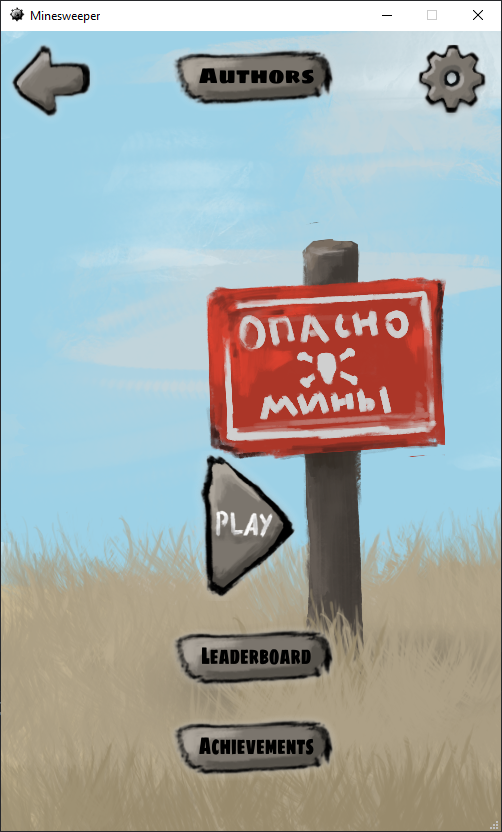
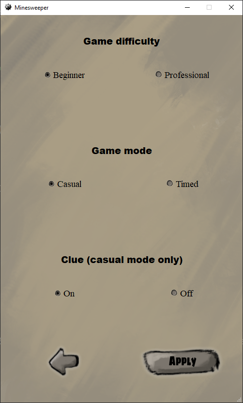
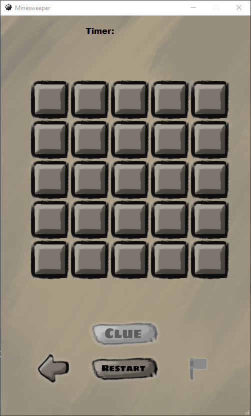
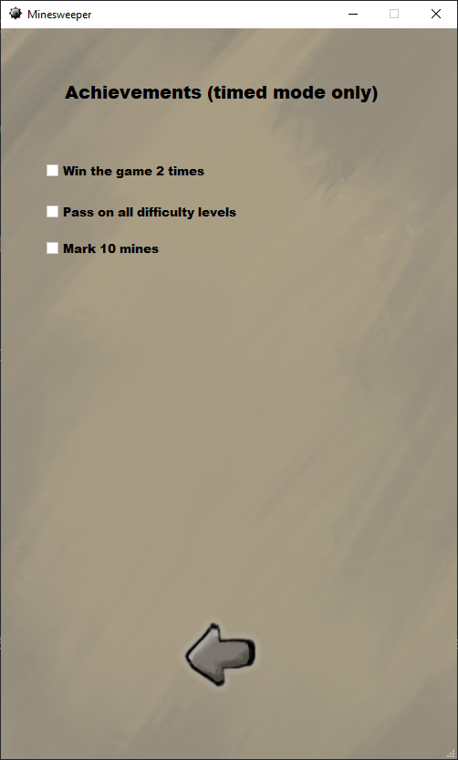
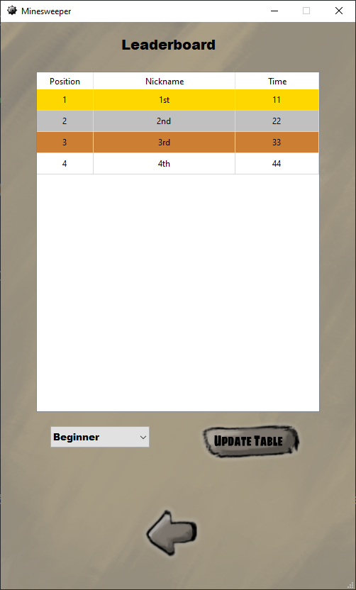

# 🧨 Классический Сапёр

Это моя реализация классического **Сапёра** — с кастомной графикой, таблицей лидеров, достижениями, гибкими настройками и полноценной системой хранения данных.

---

## 📚 О проекте

Проект был выполнен **в учебных целях** как часть итогового задания для **Я. Лицея**.

Среди обязательных требований к проекту были:

- Использование **`.csv`**, **`.txt`**, **`.sqlite`**
- Работа с **несколькими формами** и **диалоговыми окнами**
- Использование **изображений**
- **Изменение данных в БД**
- Наличие **`.exe` файла**
- Хранение данных в **нескольких таблицах** в одной базе

---

## 🛠 Технологии

Проект написан на **Python 3.13** с использованием **PyQt6** для создания графического пользовательского интерфейса.  
Такой стек позволяет создать современное и кроссплатформенное приложение с богатым UI.

---

> ❗ Несмотря на учебный характер, проект выполнен в **максимально боевом режиме**:
>
> - Четкая модульная структура кода
> - Разделение логики, интерфейса и хранения данных
> - Продуманный UI
> - Все требования реализованы, проект можно легко расширять
> - В коде нет логирования — и это **осознанное решение**

---

## ❌ Почему нет логирования?

Логирование — важная часть боевых приложений, но в рамках учебного проекта было решено отказаться от него, чтобы:

- Сохранить **максимальную читаемость кода**
- Избежать усложнения архитектуры на проверке
- Сосредоточиться на **функциональности и интерфейсе**

---

## 📂 Файлы данных и база

Проект использует три разных формата хранения данных — в соответствии с требованиями:

- **`achievements.csv`** *(в `backend/data/`)* — хранит прогресс достижений игрока
- **`authors.txt`** *(в `backend/data/`)* — содержит список разработчиков проекта:  
  - Я — разработчик, автор логики, программист  
  - Дизайнер — автор графики и визуального оформления
- **`storage.sqlite`** *(в `backend/data/`)* — основная база данных, содержит две таблицы:
  - `leaderboard` — таблица с результатами в режиме Timed
  - `settings` — пользовательские настройки игры (уровень сложности, режим игры, с подсказками или без (только в режиме Casual))

Все данные **читаются и изменяются программой динамически**, без ручного редактирования файлов.

---

## 📁 Структура проекта


```
Minesweeper
├───.idea
├───build
│   └───main
│       └───localpycs
├───dist
│   ├───backend
│   │   ├───data
│   │   └───modules
│   │       └───__pycache__
│   └───frontend
│       ├───chapters
│       │   └───__pycache__
│       ├───images
│       │   ├───backgrounds
│       │   ├───buttons
│       │   ├───dots
│       │   ├───game_utils
│       │   └───logo
│       └───ui_files
└───screenshots
```


---

## 📸 Скриншоты интерфейса

### 🎮 Главное меню  


---

### ⚙️ Настройки  
Выбор уровня сложности, режима, включение подсказок.  


---

### 🏁 Игровой процесс  
Минималистичный, но аккуратный UI, адаптированный под оба режима.  



---

### 🏆 Достижения (только в Timed-режиме)  


---

### 🥇 Таблица лидеров  
Фильтрация по Beginner/Professional. Только в Timed-режиме.  

---


## 🚀 Как запустить

1. Склонируй репозиторий:
   ```bash
   git clone https://github.com/st0rmeed/Minesweeper.git
2. В папке dist запусти main.exe

